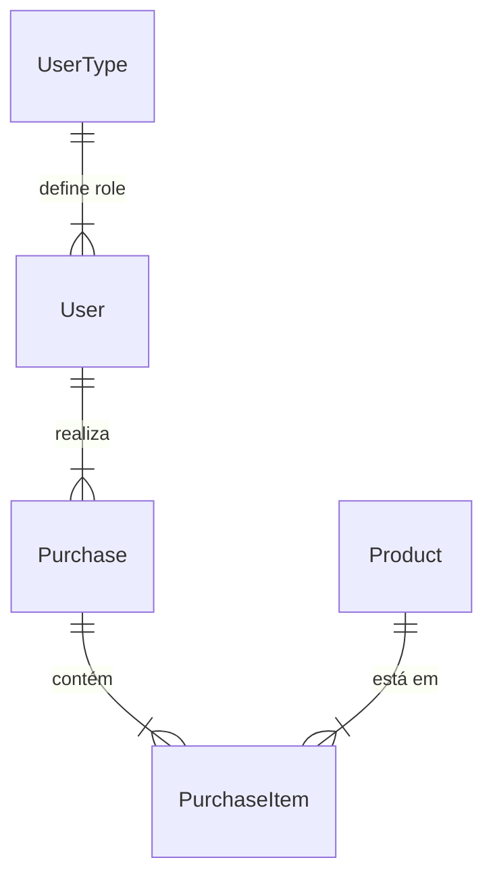

# Banco de Dados (Prisma ORM)

[← Voltar para o Menu Principal](./README.md)

## Modelagem (Requisito 2.4)

O projeto utiliza o **Prisma ORM** com banco de dados **MySQL**. O esquema do banco (`schema.prisma`) define as seguintes tabelas e relacionamentos:

### Tabelas Principais

1.  **User**: Armazena os usuários do sistema.
    *   Relacionamento: Pertence a um `UserType`.
    *   Relacionamento: Possui várias `Purchases`.
2.  **UserType**: Define os papéis de usuário (`client`, `admin`).
3.  **Product**: Produtos disponíveis na loja.
    *   Campos: `name`, `description`, `price`, `stock`.
4.  **Purchase**: Representa uma compra realizada.
    *   Campos: `status` (Enum: PENDING, PROCESSING, SHIPPED, DELIVERED, CANCELLED), `totalAmount`.
    *   Relacionamento: Pertence a um `User`.
    *   Relacionamento: Possui vários `PurchaseItems`.
5.  **PurchaseItem**: Itens individuais dentro de uma compra.
    *   Relacionamento: Liga `Purchase` e `Product`.
    *   Armazena o preço histórico (`priceAtPurchase`) para garantir integridade financeira.

### Diagrama Simplificado

---
[Próximo: Autenticação e Sessão →](./auth.md)
